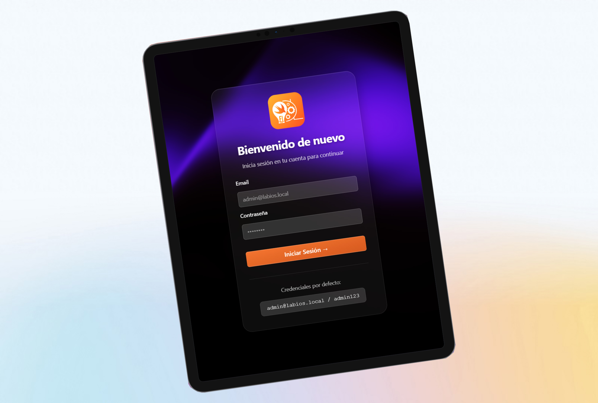
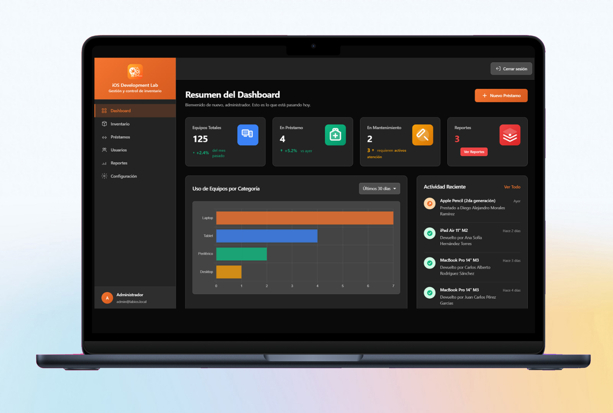
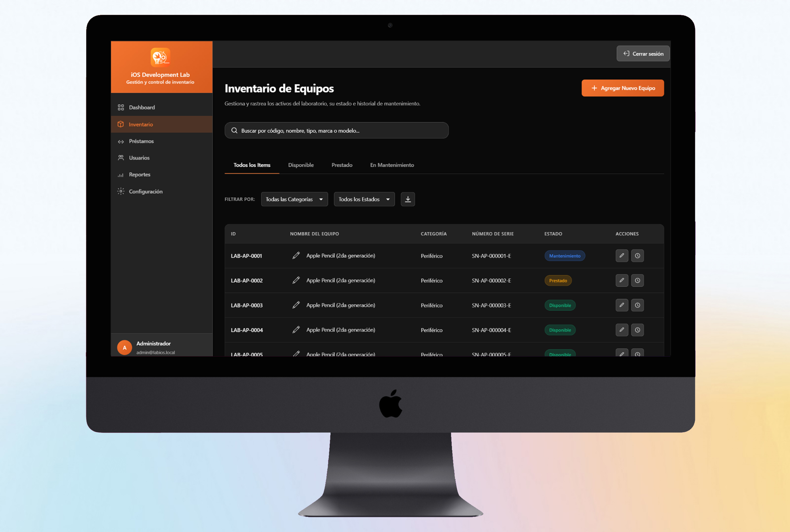
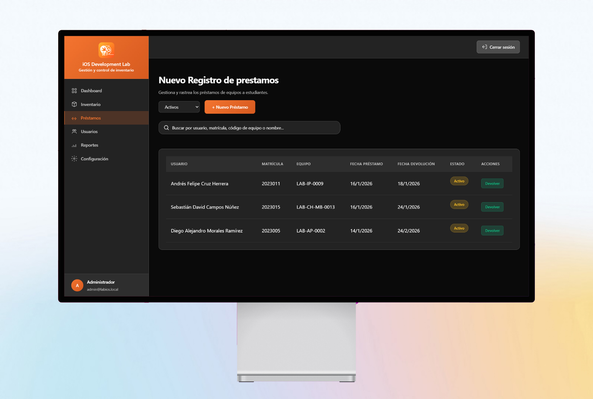
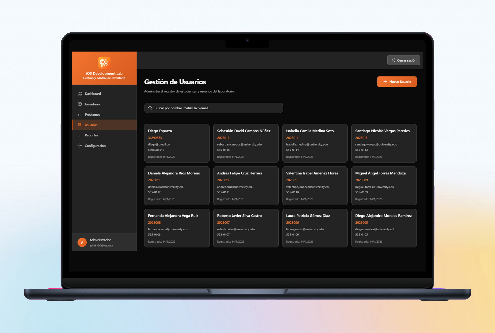
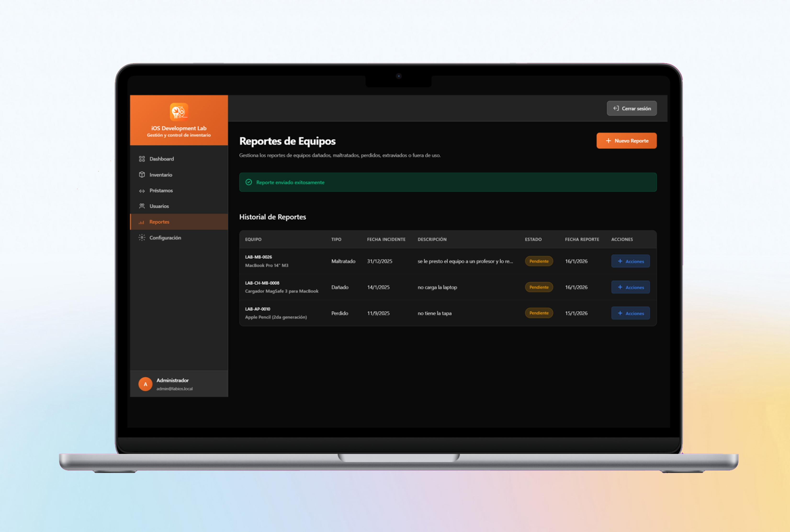
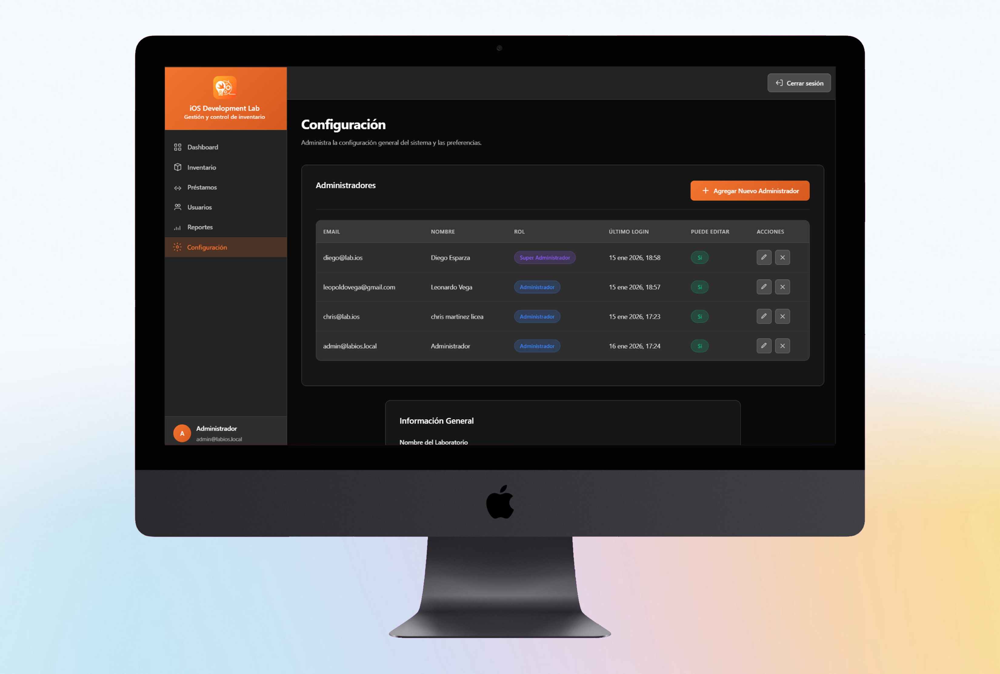

# Sistema Integral de Gestión de Inventario y Control de Préstamos para el iOS Lab

Sistema web Fullstack para la gestión de inventario y control de préstamos del Laboratorio Abierto (LabIOS).

## 🚀 Tecnologías

### Frontend

#### Framework y Biblioteca Base
- **React 19.1.0** - Se utilizó para construir la interfaz de usuario del sistema de gestión de inventario y préstamos. Permite crear componentes reutilizables para las diferentes secciones (Dashboard, Inventario, Préstamos, Usuarios, Reportes, Configuración) y manejar el estado de forma eficiente con Hooks como useState y useEffect.
- **React DOM 19.1.0** - Renderizador necesario para que React pueda actualizar dinámicamente la interfaz cuando cambian los datos del inventario, préstamos o estadísticas sin recargar la página completa.

#### Enrutamiento
- **React Router DOM 6.20.0** - Se implementó para crear una Single Page Application (SPA) con navegación fluida entre las diferentes secciones del sistema. Permite proteger rutas con autenticación (redirigir al login si no hay sesión activa) y mantener el estado de la aplicación durante la navegación.

#### Build Tool y Desarrollo
- **Vite 7.0.0** - Se eligió como herramienta de construcción por su velocidad en desarrollo y capacidad de configurar un proxy que redirige las peticiones `/api` al backend PHP en XAMPP (`http://localhost/lab-ios/backend/api`), permitiendo que el frontend React se comunique con el backend sin problemas de CORS.

#### Visualización de Datos
- **Chart.js 4.5.1** - Se utilizó para crear los gráficos del Dashboard que muestran estadísticas visuales como "Equipos por Categoría" (gráfico de barras horizontal) y otros datos importantes del sistema, facilitando la comprensión rápida de la información.
- **React-ChartJS-2 5.3.1** - Wrapper necesario para integrar Chart.js con React de forma reactiva, permitiendo que los gráficos se actualicen automáticamente cuando cambian los datos obtenidos de la API del Dashboard.

#### Estilos y Diseño
- **Tailwind CSS 4.1.18** - Se implementó para acelerar el desarrollo de la interfaz con clases utility-first, permitiendo crear componentes como botones, cards, modales y formularios de forma rápida y consistente en todas las páginas del sistema.
- **CSS3** - Se utilizó para estilos personalizados específicos del proyecto que no se pueden lograr fácilmente con Tailwind, como las animaciones del componente Dark Veil en el login, estilos de tablas personalizadas, y efectos visuales únicos de la interfaz.

#### Utilidades
- **clsx 2.1.1** - Se utilizó para aplicar clases CSS condicionalmente en componentes React, especialmente útil para manejar estados activos/inactivos en tabs, botones, badges de estado (disponible/prestado/mantenimiento) y otros elementos interactivos.
- **tailwind-merge 3.4.0** - Función utilizada en el helper `cn()` para combinar clases de Tailwind de forma inteligente, resolviendo conflictos cuando se aplican clases condicionales y evitando duplicados que podrían causar problemas de estilo.

#### TypeScript
- **@types/react 19.1.8** - Definiciones de tipos que proporcionan autocompletado y verificación de tipos en el IDE, mejorando la experiencia de desarrollo y reduciendo errores al trabajar con props y métodos de React.
- **@types/react-dom 19.1.6** - Tipos necesarios para métodos de React DOM como render y createRoot, proporcionando IntelliSense completo durante el desarrollo.

### Backend

- **PHP 8.x** - Se utilizó para crear la API REST que maneja todas las operaciones CRUD del sistema (inventario, préstamos, usuarios, reportes, administradores). Se eligió PHP por su integración nativa con XAMPP y facilidad para trabajar con MySQL/MariaDB, además de ser ideal para un entorno de desarrollo académico.
- **MySQL/MariaDB** - Base de datos relacional utilizada para almacenar toda la información del sistema: equipos del inventario, préstamos activos e históricos, usuarios registrados, reportes de equipos, administradores y configuraciones. Se eligió por su compatibilidad con XAMPP y facilidad de uso en entornos educativos.
- **Apache** - Servidor web HTTP proporcionado por XAMPP que sirve la aplicación PHP y maneja las peticiones del frontend React. Se utiliza porque viene integrado con XAMPP, facilitando la configuración del entorno de desarrollo local sin necesidad de configuraciones complejas.

## 📋 Requisitos Previos

- XAMPP instalado y configurado
- Node.js 18+ y npm
- Navegador web moderno

## 🛠️ Instalación

### 1. Configurar Base de Datos

1. Inicia XAMPP y asegúrate de que Apache y MySQL estén corriendo
2. Abre phpMyAdmin: `http://localhost/phpmyadmin`
3. Importa el archivo `database/schema.sql` para crear la base de datos y tablas

### 2. Instalar Dependencias del Frontend

```bash
npm install
```

### 3. Configurar Backend

El backend PHP ya está configurado en `backend/`. Asegúrate de que:
- Los directorios `uploads/responsivas` y `uploads/reportes` existan
- Los permisos de escritura estén habilitados en estos directorios
- La configuración de base de datos en `backend/config/database.php` coincida con tu entorno XAMPP (por defecto: usuario `root`, contraseña vacía)

### 4. Iniciar el Proyecto

```bash
# Terminal 1: Frontend (React)
npm run dev

# Terminal 2: Asegúrate de que XAMPP esté corriendo
# Apache y MySQL deben estar activos
```

## 🌐 Acceso

- **Frontend**: http://localhost:5173
- **Backend API**: http://localhost/lab-ios/backend/api
- **phpMyAdmin**: http://localhost/phpmyadmin

## 🔐 Credenciales por Defecto

- **Email**: admin@labios.local
- **Contraseña**: admin123

## 📁 Estructura del Proyecto

```
lab-ios/
├── backend/              # API PHP
│   ├── api/             # Endpoints
│   ├── config/          # Configuración
│   ├── middleware/     # Autenticación
│   └── utils/           # Utilidades
├── database/            # Scripts SQL
├── src/                 # Frontend React
│   ├── components/      # Componentes reutilizables
│   ├── pages/           # Páginas principales
│   ├── services/        # Servicios API
│   └── context/         # Context API
└── uploads/             # Archivos subidos
```

## ✨ Funcionalidades

- ✅ Dashboard con estadísticas en tiempo real
- ✅ Gestión de inventario de equipos
- ✅ Sistema de préstamos y devoluciones
- ✅ Registro de usuarios
- ✅ Búsqueda avanzada de usuarios
- ✅ Autenticación de administradores
- ✅ Interfaz moderna y responsive

## 📸 Capturas de Pantalla

### Página de Login

*Interfaz de inicio de sesión con diseño moderno y animación Dark Veil*

### Dashboard Principal

*Dashboard con estadísticas en tiempo real, gráficos y métricas del sistema*

### Gestión de Inventario

*Vista completa del inventario con búsqueda, filtros y acciones rápidas*

### Sistema de Préstamos

*Interfaz para gestionar préstamos y devoluciones de equipos*

### Gestión de Usuarios

*Registro y gestión de usuarios del sistema*

### Reportes de Equipos

*Sistema de reportes para equipos dañados, perdidos o fuera de uso*

### Configuración y Administradores

*Panel de configuración y gestión de administradores*

## 👥 Autores

- **Diego Esparza Rodríguez** - [diegoesr](https://github.com/diegoesr)
