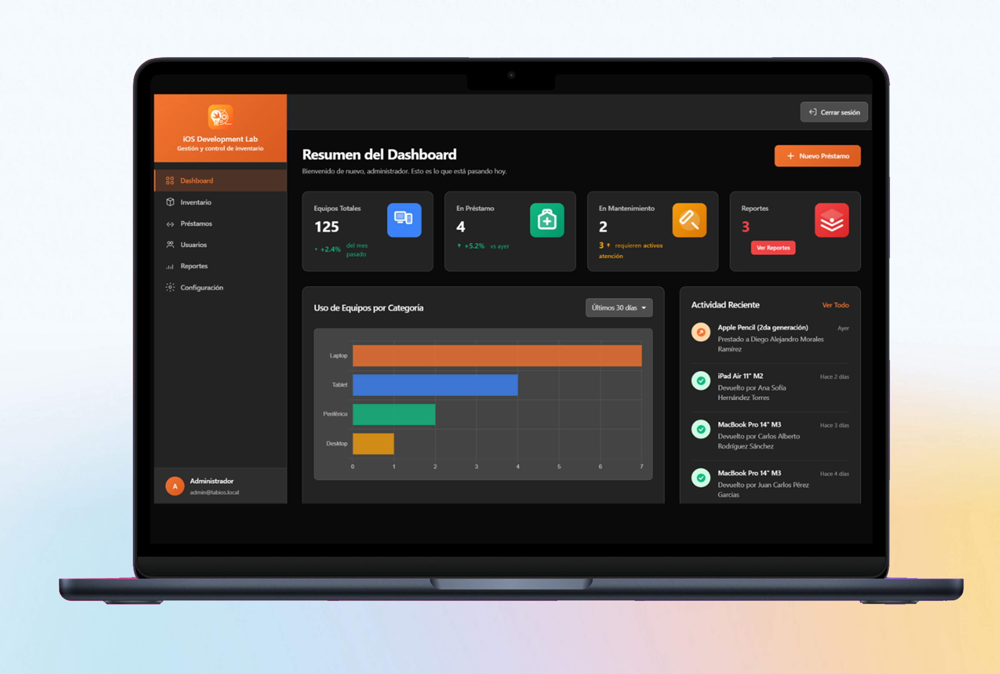
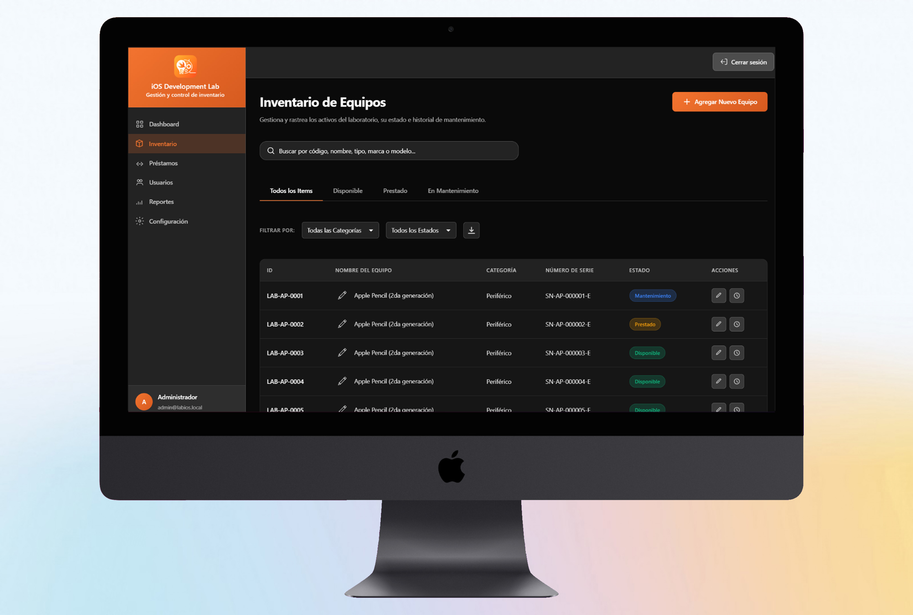
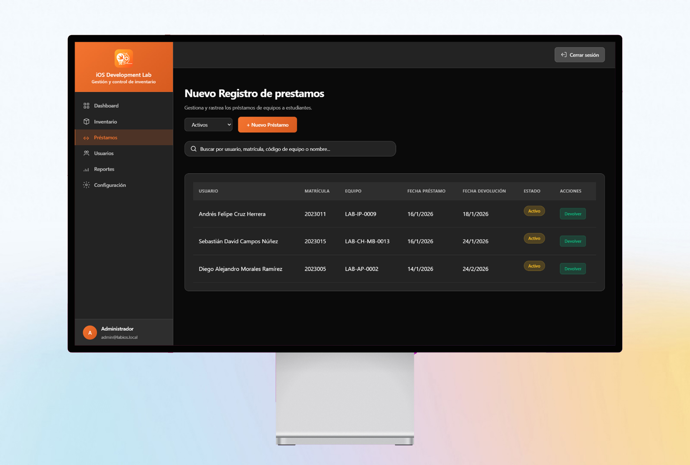
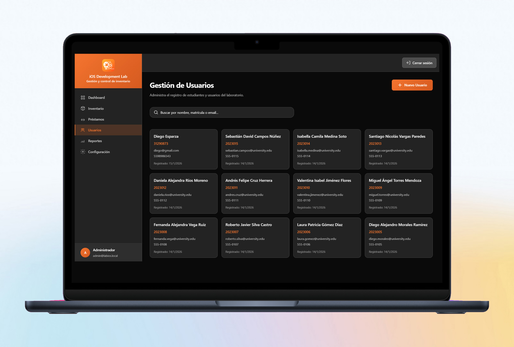
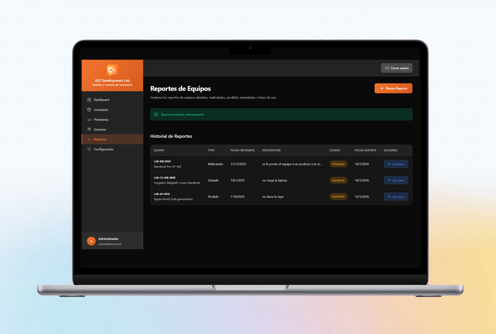
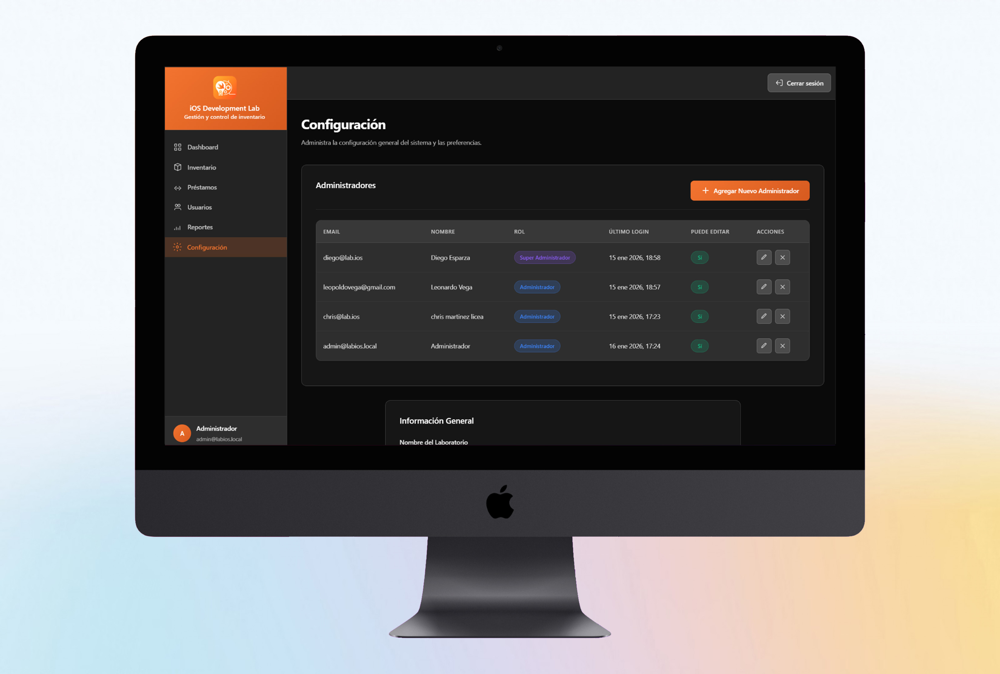

# Sistema Integral de Gestión de Inventario y Control de Préstamos para el iOS Lab

Sistema web Fullstack para la gestión de inventario y control de préstamos del Laboratorio Abierto (LabIOS).

## 🚀 Tecnologías

### Frontend

#### Framework y Biblioteca Base
- **React 19.1.0** - Se utilizó para construir la interfaz de usuario del sistema de gestión de inventario y préstamos. Permite crear componentes reutilizables para las diferentes secciones (Dashboard, Inventario, Préstamos, Usuarios, Reportes, Configuración) y manejar el estado de forma eficiente con Hooks como useState y useEffect.
- **React DOM 19.1.0** - Renderizador necesario para que React pueda actualizar dinámicamente la interfaz cuando cambian los datos del inventario, préstamos o estadísticas sin recargar la página completa.

#### Enrutamiento
- **React Router DOM 6.20.0** - Se implementó para crear una Single Page Application (SPA) con navegación fluida entre las diferentes secciones del sistema. Permite proteger rutas con autenticación (redirigir al login si no hay sesión activa) y mantener el estado de la aplicación durante la navegación.

#### Build Tool y Desarrollo
- **Vite 7.0.0** - Se eligió como herramienta de construcción por su velocidad en desarrollo y capacidad de configurar un proxy que redirige las peticiones `/api` al backend PHP. En Docker, el proxy se configura en Nginx, mientras que en desarrollo local puede configurarse para apuntar a XAMPP o al backend en Docker.

#### Visualización de Datos
- **Chart.js 4.5.1** - Se utilizó para crear los gráficos del Dashboard que muestran estadísticas visuales como "Equipos por Categoría" (gráfico de barras horizontal) y otros datos importantes del sistema, facilitando la comprensión rápida de la información.
- **React-ChartJS-2 5.3.1** - Wrapper necesario para integrar Chart.js con React de forma reactiva, permitiendo que los gráficos se actualicen automáticamente cuando cambian los datos obtenidos de la API del Dashboard.

#### Estilos y Diseño
- **Tailwind CSS 4.1.18** - Se implementó para acelerar el desarrollo de la interfaz con clases utility-first, permitiendo crear componentes como botones, cards, modales y formularios de forma rápida y consistente en todas las páginas del sistema.
- **CSS3** - Se utilizó para estilos personalizados específicos del proyecto que no se pueden lograr fácilmente con Tailwind, como las animaciones del componente Dark Veil en el login, estilos de tablas personalizadas, y efectos visuales únicos de la interfaz.

#### Utilidades
- **clsx 2.1.1** - Se utilizó para aplicar clases CSS condicionalmente en componentes React, especialmente útil para manejar estados activos/inactivos en tabs, botones, badges de estado (disponible/prestado/mantenimiento) y otros elementos interactivos.
- **tailwind-merge 3.4.0** - Función utilizada en el helper `cn()` para combinar clases de Tailwind de forma inteligente, resolviendo conflictos cuando se aplican clases condicionales y evitando duplicados que podrían causar problemas de estilo.

#### TypeScript
- **@types/react 19.1.8** - Definiciones de tipos que proporcionan autocompletado y verificación de tipos en el IDE, mejorando la experiencia de desarrollo y reduciendo errores al trabajar con props y métodos de React.
- **@types/react-dom 19.1.6** - Tipos necesarios para métodos de React DOM como render y createRoot, proporcionando IntelliSense completo durante el desarrollo.

### Backend

- **PHP 8.2** - Se utilizó para crear la API REST que maneja todas las operaciones CRUD del sistema (inventario, préstamos, usuarios, reportes, administradores). Se eligió PHP por su integración nativa con Apache y facilidad para trabajar con MySQL/MariaDB. En Docker, se ejecuta con PHP 8.2 y Apache, mientras que en desarrollo local puede usarse con XAMPP.
- **MySQL 8.0** - Base de datos relacional utilizada para almacenar toda la información del sistema: equipos del inventario, préstamos activos e históricos, usuarios registrados, reportes de equipos, administradores y configuraciones. En Docker se ejecuta MySQL 8.0 con configuración UTF-8 (utf8mb4) para soportar caracteres especiales. También es compatible con XAMPP para desarrollo local.
- **Apache** - Servidor web HTTP que sirve la aplicación PHP y maneja las peticiones del frontend React. En Docker se ejecuta Apache 2.4 con módulos de rewrite y headers habilitados. También puede usarse con XAMPP para desarrollo local.

### Contenedorización

- **Docker** - Se implementó Docker para facilitar el despliegue y desarrollo del proyecto. Permite ejecutar toda la aplicación (frontend, backend, base de datos y gestor de BD) en contenedores aislados, eliminando problemas de compatibilidad entre entornos y simplificando la configuración inicial. Todos los archivos de Docker están organizados en la carpeta `docker/` para mantener el proyecto limpio y organizado.
- **Docker Compose** - Se utiliza para orquestar los múltiples servicios (MySQL 8.0, PHP 8.2/Apache, React/Nginx, Adminer) con un solo comando, gestionando automáticamente las redes, volúmenes y dependencias entre contenedores.
- **Adminer** - Interfaz gráfica web moderna para gestionar la base de datos MySQL. Es más ligero y moderno que phpMyAdmin, con una interfaz limpia y responsiva. Se ejecuta como servicio adicional en Docker y permite gestionar la base de datos desde el navegador sin necesidad de herramientas externas.

## 🔧 Implementación Técnica y Beneficios

### Arquitectura Frontend-Backend Separada

**React SPA con API REST**: Se implementó una arquitectura de cliente-servidor donde React maneja toda la lógica de presentación y PHP actúa como API RESTful. Esta separación permite:
- **Escalabilidad**: El frontend puede ser desplegado en un CDN mientras el backend permanece en el servidor
- **Mantenibilidad**: Cambios en la UI no afectan la lógica de negocio y viceversa
- **Reutilización**: La API puede ser consumida por otras aplicaciones (móvil, desktop, etc.)

**Vite Proxy Configuration**: Se configuró un proxy en `vite.config.js` que redirige todas las peticiones `/api` al backend PHP (`http://localhost/lab-ios/backend/api`), resolviendo problemas de CORS en desarrollo y permitiendo una comunicación transparente entre frontend y backend sin necesidad de configurar CORS complejo en Apache.

### Gestión de Estado con React Context API

**AuthContext para Autenticación Global**: Se implementó un contexto de autenticación (`AuthContext.jsx`) que:
- **Persistencia de sesión**: Utiliza `localStorage` para mantener la sesión del usuario entre recargas de página
- **Estado global reactivo**: Cualquier componente puede acceder al estado de autenticación mediante `useAuth()` hook
- **Protección de rutas**: El componente `ProtectedRoute` verifica la autenticación antes de renderizar páginas protegidas, redirigiendo automáticamente al login si no hay sesión activa
- **Manejo de errores mejorado**: Implementa detección específica de errores de red (servidor no disponible) con mensajes descriptivos para el usuario

### Sistema de Autenticación con Tokens

**Token-based Authentication**: Se implementó un sistema de autenticación basado en tokens:
- **Generación de tokens**: El backend genera tokens codificados en Base64 con información del usuario y expiración (24 horas)
- **Middleware de autenticación**: Cada endpoint protegido verifica el token mediante `verificarToken()` que:
  - Extrae el token del header `Authorization: Bearer <token>` de múltiples formas (compatibilidad con diferentes servidores)
  - Valida la expiración del token
  - Retorna error 401 si el token es inválido o expirado
- **Interceptores HTTP**: El servicio `api.js` intercepta automáticamente todas las peticiones para agregar el token en los headers y manejar respuestas 401 redirigiendo al login

### Manejo de Errores y Timeouts

**AbortController para Timeouts**: Se implementó un sistema de timeout de 10 segundos en todas las peticiones HTTP:
- **Prevención de esperas infinitas**: Si el servidor no responde, se cancela la petición automáticamente
- **Mensajes específicos**: Diferencia entre errores de red, timeout y errores del servidor, proporcionando mensajes útiles al usuario
- **Detección de servidor**: Mensajes específicos cuando el servidor backend no está disponible, guiando al usuario a solucionar el problema

**Validación de Respuestas**: El servicio API verifica el `Content-Type` de las respuestas antes de parsear JSON, evitando errores cuando el servidor retorna HTML de error en lugar de JSON.

### Optimización de Rendimiento

**Lazy Loading y Code Splitting**: React Router permite:
- **Carga bajo demanda**: Cada ruta carga solo su componente cuando es necesario
- **Reducción del bundle inicial**: El código se divide en chunks más pequeños, mejorando el tiempo de carga inicial

**Consultas SQL Optimizadas**: 
- **Índices en base de datos**: Las tablas principales tienen índices en columnas frecuentemente consultadas (`usuario_id`, `equipo_id`, `estado`)
- **Agregación en servidor**: Los cálculos estadísticos se realizan en MySQL con `GROUP BY` y funciones de agregación, reduciendo el procesamiento en el cliente
- **Filtrado en base de datos**: Las búsquedas y filtros se aplican directamente en las consultas SQL con `WHERE` y `LIKE`, evitando traer datos innecesarios


## 📋 Requisitos Previos

- Docker Desktop instalado y ejecutándose
- Docker Compose v3.8 o superior
- Navegador web moderno

## 🛠️ Instalación con Docker

### Opción 1: Docker Compose (Recomendado)

1. **Navegar a la carpeta docker**:
```bash
cd docker
```

2. **Construir y ejecutar los contenedores**:
```bash
docker-compose up -d --build
```

3. **Ver los logs** (opcional):
```bash
docker-compose logs -f
```

4. **Acceder a la aplicación**:
   - **Frontend**: http://localhost:3000
   - **Backend API**: http://localhost:8888/api

La base de datos se inicializa automáticamente con el esquema y datos de ejemplo.

### Comandos Docker Útiles

```bash
# Desde la carpeta docker/
cd docker

# Detener contenedores
docker-compose down

# Reiniciar un servicio
docker-compose restart backend

# Ver estado de contenedores
docker-compose ps

# Acceder a la base de datos
docker exec -it labios_db mysql -u labios_user -plabios_password labios_db

# Ver logs de un servicio específico
docker-compose logs -f backend
```

## 🌐 Acceso

### Con Docker:
- **Frontend**: http://localhost:3000
- **Backend API**: http://localhost:8888/api
- **Base de datos**: localhost:3307 (usuario: `labios_user`, contraseña: `labios_password`)
- **Adminer (Gestor BD)**: http://localhost:8082

### Sin Docker:
- **Frontend**: http://localhost:5173
- **Backend API**: http://localhost/lab-ios/backend/api

## 🔐 Credenciales por Defecto

- **Email**: admin@labios.local
- **Contraseña**: admin123

## 📁 Estructura del Proyecto

```
lab-ios/
├── backend/              # API PHP
│   ├── api/             # Endpoints
│   ├── config/          # Configuración
│   ├── middleware/     # Autenticación
│   └── utils/           # Utilidades
├── database/            # Scripts SQL
├── docker/              # Configuración Docker
│   ├── docker-compose.yml
│   ├── frontend/
│   │   ├── Dockerfile
│   │   └── nginx.conf
│   └── backend/
│       ├── Dockerfile
│       └── apache-config.conf
├── src/                 # Frontend React
│   ├── components/      # Componentes reutilizables
│   ├── pages/           # Páginas principales
│   ├── services/        # Servicios API
│   └── context/         # Context API
└── uploads/             # Archivos subidos
```

## ✨ Funcionalidades

- ✅ Dashboard con estadísticas en tiempo real
- ✅ Gestión de inventario de equipos
- ✅ Sistema de préstamos y devoluciones
- ✅ Registro de usuarios
- ✅ Búsqueda avanzada de usuarios
- ✅ Autenticación de administradores
- ✅ Interfaz moderna y responsive

## 📸 Capturas de Pantalla

### Página de Login

*Interfaz de inicio de sesión con diseño moderno y animación Dark Veil*

### Dashboard Principal

*Dashboard con estadísticas en tiempo real, gráficos y métricas del sistema*

### Gestión de Inventario

*Vista completa del inventario con búsqueda, filtros y acciones rápidas*

### Sistema de Préstamos

*Interfaz para gestionar préstamos y devoluciones de equipos*

### Gestión de Usuarios

*Registro y gestión de usuarios del sistema*

### Reportes de Equipos

*Sistema de reportes para equipos dañados, perdidos o fuera de uso*

### Configuración y Administradores

*Panel de configuración y gestión de administradores*

## 🐳 Docker

### Estructura de Archivos Docker

Todos los archivos relacionados con Docker están organizados en la carpeta `docker/` para mantener el proyecto limpio y organizado:

```
docker/
├── docker-compose.yml      # Orquestación de servicios
├── README.md               # Guía rápida de Docker
├── frontend/
│   ├── Dockerfile          # Imagen del frontend React
│   └── nginx.conf          # Configuración de Nginx
└── backend/
    ├── Dockerfile          # Imagen del backend PHP
    └── apache-config.conf  # Configuración de Apache
```

### Uso Básico

Para usar Docker, navega a la carpeta `docker/` y ejecuta:

```bash
cd docker

# Construir y ejecutar todos los servicios
docker-compose up -d --build

# Ver logs
docker-compose logs -f

# Detener servicios
docker-compose down
```

### Servicios Incluidos

El `docker-compose.yml` incluye cuatro servicios:

1. **db** (MySQL 8.0)
   - Puerto: `3307` (mapeado desde el puerto interno 3306)
   - Usuario: `labios_user`
   - Contraseña: `labios_password`
   - Base de datos: `labios_db`
   - Los scripts SQL en `../database/` se ejecutan automáticamente al iniciar

2. **backend** (PHP 8.2 + Apache)
   - Puerto: `8888`
   - Monta el directorio `../backend/` como volumen para desarrollo
   - Monta `../uploads/` para persistir archivos subidos

3. **frontend** (React + Nginx)
   - Puerto: `3000`
   - Servido con Nginx en modo producción
   - Proxy configurado para `/api` → backend

4. **adminer** (Interfaz gráfica MySQL)
   - Puerto: `8082`
   - Interfaz web moderna para gestionar la base de datos
   - Acceso: http://localhost:8082
   - Credenciales de conexión:
     - Sistema: `MySQL`
     - Servidor: `db`
     - Usuario: `labios_user`
     - Contraseña: `labios_password`
     - Base de datos: `labios_db`

### Gestión de Base de Datos con Adminer

Adminer es la interfaz gráfica incluida para gestionar la base de datos MySQL. Para acceder:

1. **Abrir Adminer**: http://localhost:8082
2. **Credenciales de conexión**:
   - Sistema: `MySQL`
   - Servidor: `db`
   - Usuario: `labios_user`
   - Contraseña: `labios_password`
   - Base de datos: `labios_db`

**Ventajas de Adminer**:
- Interfaz moderna y responsiva
- Más ligero que phpMyAdmin (~50MB vs ~500MB)
- Una sola página PHP, más rápido
- Integración perfecta con Docker
- Permite ejecutar consultas SQL, gestionar tablas, importar/exportar datos

### Variables de Entorno

Las variables de entorno están configuradas en `docker/docker-compose.yml`:

```yaml
environment:
  - DB_HOST=db
  - DB_NAME=labios_db
  - DB_USER=labios_user
  - DB_PASSWORD=labios_password
```

Para cambiar estas variables, edita `docker/docker-compose.yml` y reinicia los servicios.

## 👥 Autores

- **Diego Esparza Rodríguez** - [diegoesr](https://github.com/diegoesr)
